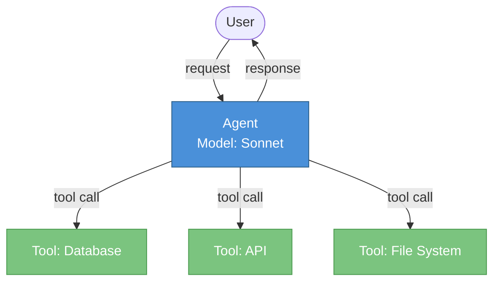
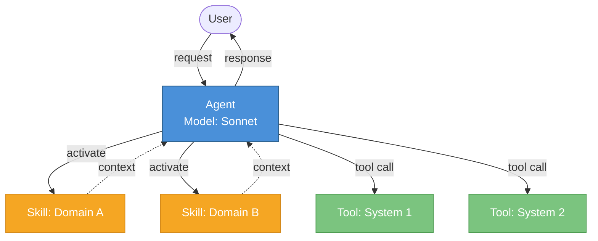
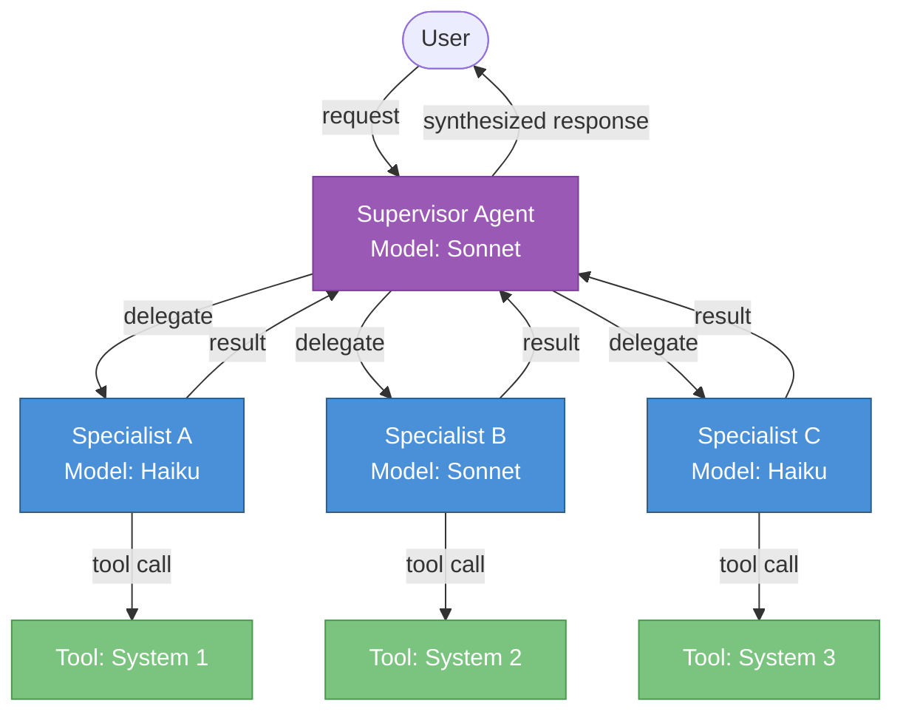
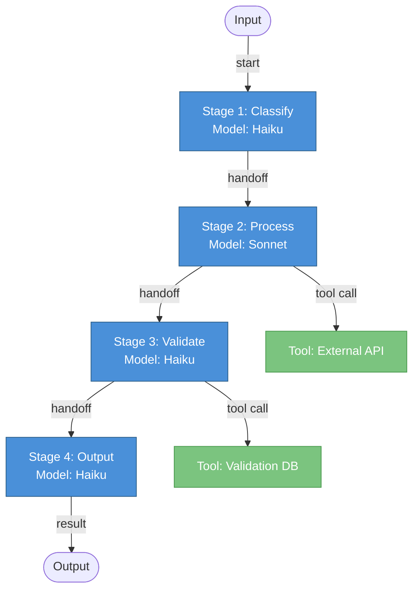
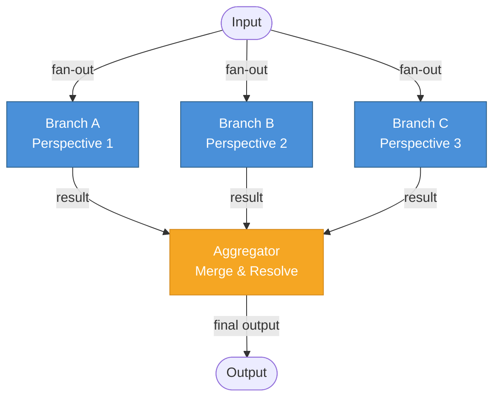
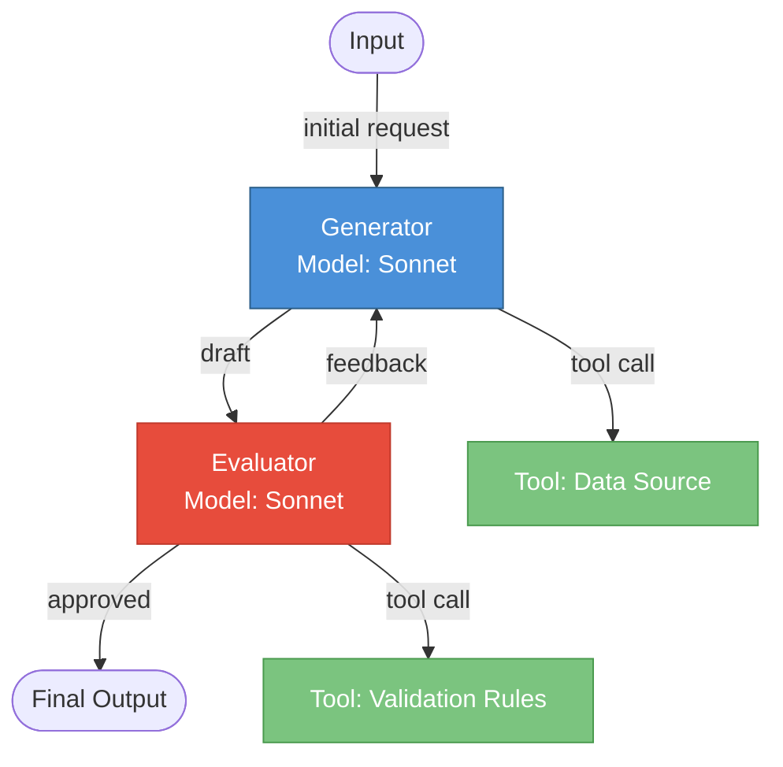
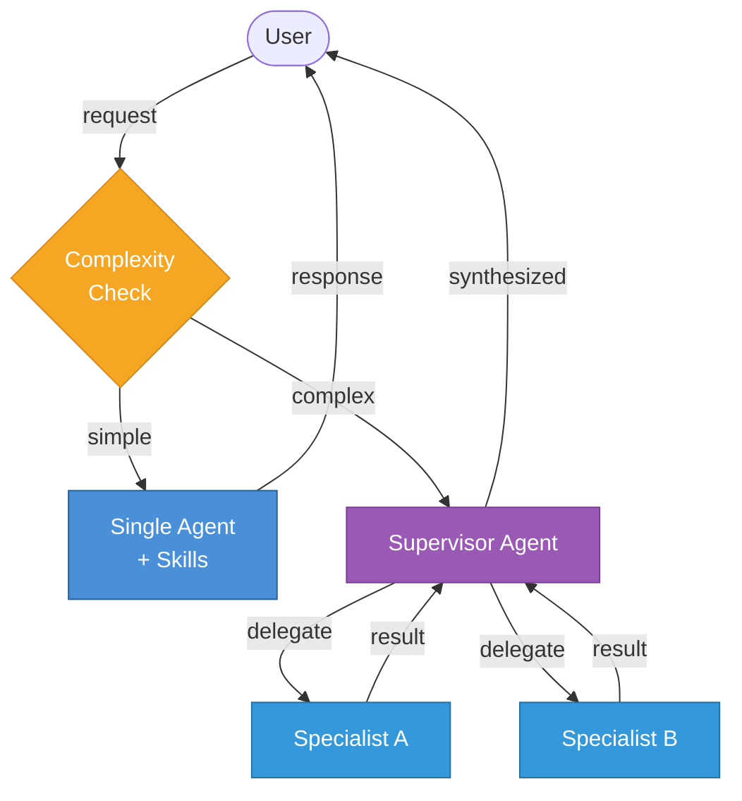

# Mermaid Diagram Templates for Architecture Blueprints

Use these templates when generating the "Architecture Diagram" section in Phase 3. Select the template matching the recommended pattern, then customize with actual component names from the interview.

## Rules

1. **Always use top-down (TD) layout** for consistency
2. **Label every edge** with the interaction type (tool call, message, data, event)
3. **Color-code by role:** use `:::supervisor` for orchestrators, `:::worker` for agents, `:::tool` for integrations. These are the base classes; templates may add pattern-specific classes as needed (e.g., `:::skill`, `:::branch`, `:::merge`, `:::gen`, `:::eval`, `:::router`)
4. **Keep it readable:** max 8-10 nodes per diagram. If more complex, split into overview + detail diagrams
5. **Include a legend** as a comment at the top

---

## Single Agent

---

## Single Agent + Skills

---

## Hierarchical Multi-Agent

---

## Sequential Workflow

---

## Parallel Workflow

---

## Evaluator-Optimizer

---

## Hybrid: Single Agent + Multi-Agent Escalation

---

## Customization Checklist

When adapting a template for a specific blueprint:

1. Replace generic names (Specialist A, System 1) with actual names from the interview (e.g., "Order Agent", "Shopify API")
2. Add the recommended model tier to each agent node (Opus/Sonnet/Haiku)
3. Label edges with specific data types (e.g., "order JSON", "customer record")
4. Add any MCP connections as tool nodes
5. If brownfield: add a "Legacy System" node with dashed lines showing integration points
6. Keep the color scheme consistent across all diagrams in the same blueprint
